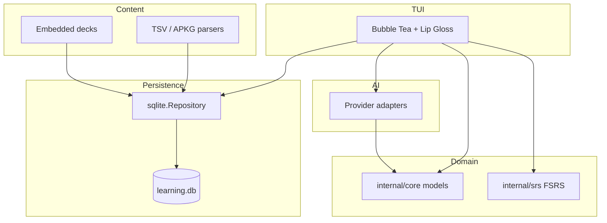

<a id="top"></a>

<p align="center">
  
</p>

<p align="center">
  
</p>

<p align="center">
  
  
  
  
  
</p>

<p align="center">
  <a href="#-features">✨ Features</a> &nbsp;•&nbsp; <a href="#-installation">🚀 Install</a> &nbsp;•&nbsp; <a href="#-usage">🎮 Usage</a> &nbsp;•&nbsp; <a href="#-contributing">🤝 Contribute</a>
</p>

<!-- Record a terminal demo with https://github.com/charmbracelet/vhs or https://github.com/faressoft/terminalizer and save as assets/demo.gif -->
<p align="center"></p>

<p align="center"><sub>Add <code>assets/demo.gif</code> to the repo (path above) so this renders.</sub></p>

<br/>

## ✨ Features

<table>
<tr>
<td width="50%">📚 <b>FSRS scheduling</b><br/>Spaced repetition via <code>go-fsrs</code> with grades persisted in SQLite.</td>
<td width="50%">🖱️ <b>Mouse + keyboard</b><br/>Tabs, buttons, scrollbars, and WASD-friendly navigation.</td>
</tr>
<tr>
<td>🗂️ <b>Decks & cram</b><br/>Deck list with limits, filters, merge/cram shortcuts, and session stats.</td>
<td>🔍 <b>Browser</b><br/>Search, tags, bulk actions, card preview, and review history.</td>
</tr>
<tr>
<td>📥 <b>Anki-friendly I/O</b><br/>Import/export TSV and <code>.apkg</code>; seed rich embedded German content.</td>
<td>🤖 <b>AI drafting</b><br/>Offline/template providers and configurable prompt sets for new cards.</td>
</tr>
<tr>
<td>📊 <b>Statistics</b><br/>Progress, streaks, session timing, and CSV export.</td>
<td>🎯 <b>Review modes</b><br/>MCQ, cloze, typing check, focus mode, audio hooks, dictionary shortcut.</td>
</tr>
</table>

<p align="right"><a href="#top">↑ back to top</a></p>

<p align="center">───────────────────────────────────────────────</p>

## 🏗️ Architecture

Local-first modular monolith: domain core stays pure; IO lives in storage, content, AI, and TUI layers.



<p align="right"><a href="#top">↑ back to top</a></p>

<p align="center">───────────────────────────────────────────────</p>

## 🚀 Getting Started

### Prerequisites

<p align="center">
  
  
  
</p>

For full repo verification (optional): Python 3 with `pytest` / `pytest-xdist` for parallel E2E tests under `e2e_tests/`.

<a id="-installation"></a>

### 🚀 Installation

1. Clone the repository.

```bash
git clone https://github.com/tungnguyenlam/language-learning-tui.git
```

2. Enter the project directory.

```bash
cd language-learning-tui
```

3. Run the app (Go downloads modules automatically).

```bash
go run ./cmd/deutsch-tui
```

4. Optional: use a custom data directory.

```bash
go run ./cmd/deutsch-tui -data-dir ./my-data
```

5. Optional: smoke-check initialization then exit.

```bash
go run ./cmd/deutsch-tui -smoke
```

> 💡 **Tip:** The Go module and binary are named `deutsch-tui`; default data lives under your OS user config directory in `deutsch-tui/`.

<p align="right"><a href="#top">↑ back to top</a></p>

<p align="center">───────────────────────────────────────────────</p>

<a id="-usage"></a>

## 🎮 Usage

Views are reachable via **Tab** / **Shift+Tab**, **←**/**→** (or **w**/**s**), and number keys **1**–**9** (Dashboard through Cram). Press **?** for the in-app overlay.

<details>
<summary>📋 Full keybindings reference</summary>

### Global

| Key | Action |
|-----|--------|
| `1` … `9` | Jump to Dashboard, Decks, Review, Statistics, Import, AI, Settings, Browser, Cram |
| `Tab` / `Shift+Tab`, `→` / `←`, `s` / `w` | Cycle views when not editing text |
| `[` / `]` | Previous / next deck (also reloads Browser when active) |
| `?` | Toggle help overlay |
| `q` | Quit (or exit cram session when active) |
| `ctrl+c` | Quit |
| `ctrl+d` | Toggle Debug log view |

### Review

| Key | Action |
|-----|--------|
| `↑` / `↓`, `k` / `j` | Move between due cards |
| `Space` / `Enter` | Reveal / advance reveal / start grading |
| `a` / `h` / `g` / `e` | Grade Again / Hard / Good / Easy |
| `1`–`4` | Pick MCQ choice |
| `t` | Typing mode (from idle) |
| `f` | Focus mode |
| `b` / `B` | Bookmark / bookmark-only filter |
| `x` | Suspend card |
| `u` | Undo last review |
| `r` | Toggle review history |
| `p` | Play audio |
| `d` | Open dictionary for prompt line |
| `delete` / `backspace` | Delete current card |

### Decks

| Key | Action |
|-----|--------|
| `/` | Search decks |
| `L` | Edit per-deck new/review limits |
| `Enter` | Select deck → Dashboard |
| `c` | Cram selected deck |
| `v` | Statistics for deck |
| `M` | Merge selected decks |
| `Space` / `x` | Toggle deck selection |

### Browser

| Key | Action |
|-----|--------|
| `/` | Search cards |
| `#` | Filter by tag |
| `m` | Toggle selection |
| `b` / `B`, `x` / `X`, `t` / `T` | Bookmark, suspend, kind/tags (single or bulk) |
| `Enter` | Toggle review history for card |
| `Backspace` | Delete |

### Other views

Statistics: `j`/`k` scroll, `x` export CSV. Import: `i`/`I` import TSV/APKG, `x`/`X` export, `R` reset DB (with confirmation flow). AI: `/` edit topic, `Enter` draft/approve, `[`/`]` templates, `a`/`A` / `d`/`D` approve or discard drafts. Cram: `1`–`5` filters, `Enter` start session, grades same as review when active.

</details>

<p align="right"><a href="#top">↑ back to top</a></p>

<p align="center">───────────────────────────────────────────────</p>

## ⚙️ Configuration

All paths are under the resolved data directory (`config.json`, `learning.db`, `deutsch-tui.log`, default import/export filenames).

| File / knob | Purpose |
|-------------|---------|
| `config.json` | `theme`, `keymap`, `ai_provider`, `log_level`, `autoplay_audio`, `strict_normalization`, `ai_templates` |
| `-data-dir` | Override data directory (default: OS user config dir + `/deutsch-tui`) |
| `deutsch-tui.log` | Rotating local log; adjust verbosity with `log_level` |

See [docs/ops/config-and-logs.md](docs/ops/config-and-logs.md) for defaults and layout.

<p align="right"><a href="#top">↑ back to top</a></p>

<p align="center">───────────────────────────────────────────────</p>

## 🛠️ Tech stack

<p align="center">
  
  
  
  
</p>

<p align="right"><a href="#top">↑ back to top</a></p>

<p align="center">───────────────────────────────────────────────</p>

## 🗺️ Roadmap

- [x] FSRS + SQLite + TSV/APKG interop and Bubble Tea shell
- [x] AI drafting workflow with offline/template providers
- [x] Browser, cram, statistics, focus mode, debug log
- [ ] Audio pronunciation integration
- [ ] Deck merge/split polish in UI
- [ ] Local LLM providers (e.g. Ollama)
- [ ] Custom card templates UI

<p align="right"><a href="#top">↑ back to top</a></p>

<p align="center">───────────────────────────────────────────────</p>

<a id="-contributing"></a>

## 🤝 Contributing

Issues and PRs are welcome. Run `./scripts/verify.sh` before submitting (Go tests, vet, smoke build, and parallel E2E when Python tooling is set up). Read [AGENTS.md](AGENTS.md) for agent-oriented workflow and package boundaries.

<p align="right"><a href="#top">↑ back to top</a></p>

<p align="center">───────────────────────────────────────────────</p>

## 👥 Contributors

<p align="center">
  <a href="https://github.com/tungnguyenlam/language-learning-tui/graphs/contributors"></a>
</p>

<p align="right"><a href="#top">↑ back to top</a></p>

<p align="center">───────────────────────────────────────────────</p>

## 📈 Star history

<p align="center">
  <a href="https://star-history.com/#tungnguyenlam/language-learning-tui&Date"></a>
</p>

<p align="right"><a href="#top">↑ back to top</a></p>

<p align="center">───────────────────────────────────────────────</p>

## 📄 License

MIT — see [LICENSE](LICENSE).

<p align="right"><a href="#top">↑ back to top</a></p>
