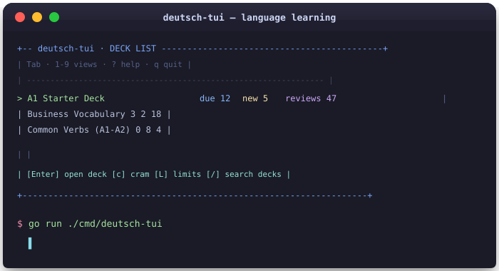
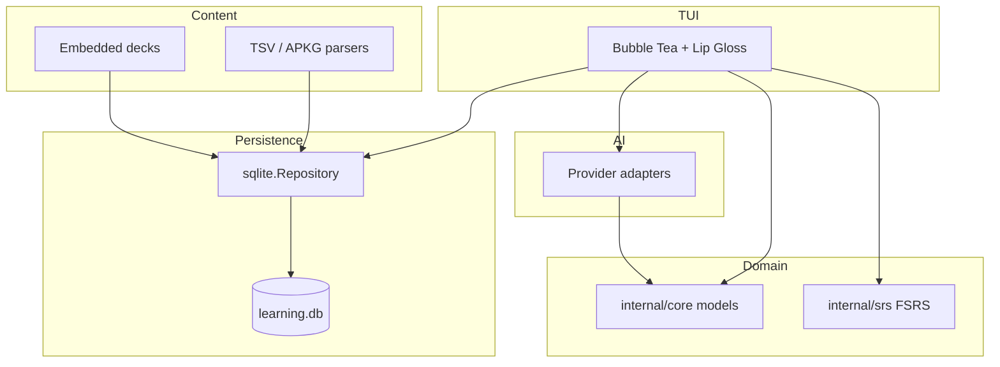

<a id="top"></a>

<p align="center">
  <picture>
    <source media="(prefers-color-scheme: dark)" srcset="assets/hero-dark.svg">
    <source media="(prefers-color-scheme: light)" srcset="assets/hero-light.svg">
    
  </picture>
</p>

<p align="center">
  
  
  
  
  
</p>

<p align="center">
  <a href="#-features">✨ Features</a> &nbsp;•&nbsp; <a href="#-why-deutsch-tui">🤔 Why</a> &nbsp;•&nbsp; <a href="#-installation">🚀 Install</a> &nbsp;•&nbsp; <a href="#-usage">🎮 Usage</a> &nbsp;•&nbsp; <a href="#-contributing">🤝 Contribute</a>
</p>

<p align="center"><em><strong>deutsch-tui</strong> is a terminal-native German flashcard and quiz app with FSRS scheduling, SQLite progress, and optional AI-assisted drafting. It is built for learners who want a fast, offline-capable workflow and keyboard-first control—without Electron or a browser tab—while staying compatible with Anki decks via TSV and <code>.apkg</code>.</em></p>

<p align="center"><sub><code>❯ cat README.md</code> — scroll on; this page is for humans and robots alike.</sub></p>

<!-- Regenerate recording: vhs demo.tape → assets/demo.gif -->
<p align="center"></p>

<p align="center"><sub>Install <a href="https://github.com/charmbracelet/vhs">VHS</a> (<code>brew install vhs</code> or <code>go install github.com/charmbracelet/vhs@latest</code>), ensure <code>ffmpeg</code> and <code>ttyd</code> are on <code>PATH</code>, then run <code>vhs demo.tape</code> from the repo root to refresh the GIF after UI changes (ideal for local prep or CI).</sub></p>

<br/>

## ✨ Features

```text
$ deutsch-tui --features

  FSRS scheduling      spaced repetition via go-fsrs + SQLite
  Mouse + keyboard   tabs, buttons, scrollbars, WASD navigation
  Decks & cram       limits, filters, merge/cram, session stats
  Browser            search, tags, bulk actions, card preview
  Anki I/O           import/export TSV and .apkg
  AI drafting        offline/template providers, prompt sets
  Statistics         streaks, timing, CSV export
  Review modes       MCQ, cloze, typing, focus, audio, dict

Press [?] for full keybindings in the app.
```

<p align="right"><a href="#top">↑ back to top</a></p>

<a id="-why-deutsch-tui"></a>

## 🤔 Why deutsch-tui?

> Prefer a **terminal** over another browser tab? Want **local-first** data with **FSRS** quality and optional **AI drafts**—without vendor lock-in? This project targets exactly that niche.

| | Anki / typical web SRS | deutsch-tui |
|--|------------------------|-------------|
| **Surface** | Desktop GUI or browser | Terminal TUI (Bubble Tea + Lip Gloss) |
| **Data** | Local collection + sync ecosystems | Single local dir: SQLite + plain config |
| **Scheduling** | SM-2 family / FSRS add-ons | Built-in **FSRS** mapping |
| **Authoring** | Full editor, shared decks | Deck files + **AI drafting** workflow + TSV / `.apkg` |

<p align="right"><a href="#top">↑ back to top</a></p>

## 🏗️ Architecture

Local-first modular monolith: domain core stays pure; IO lives in storage, content, AI, and TUI layers.



<p align="right"><a href="#top">↑ back to top</a></p>

## 🚀 Getting Started

### Prerequisites

<p align="center">
  
  
  
</p>

For full repo verification (optional): Python 3 with `pytest` / `pytest-xdist` for parallel E2E tests under `e2e_tests/`.

<a id="-installation"></a>

### 🚀 Installation

**One-liner (macOS/Linux):**

```bash
curl -sSL https://raw.githubusercontent.com/tungnguyenlam/language-learning-tui/refs/heads/main/scripts/install.sh | bash
```

**From source:**

```bash
git clone https://github.com/tungnguyenlam/language-learning-tui.git
cd language-learning-tui
go run ./cmd/deutsch-tui
```

**Binary** (same artifact E2E tests use):

```bash
make build
./deutsch-tui-bin
```

Optional custom data directory:

```bash
./deutsch-tui-bin -data-dir ./my-data
```

**Optional:** same flags with `go run`:

```bash
go run ./cmd/deutsch-tui -data-dir ./my-data
```

**Optional:** smoke-check initialization then exit:

```bash
go run ./cmd/deutsch-tui -smoke
```

> 💡 **Tip:** The Go module and binary are named `deutsch-tui`; default data lives under your OS user config directory in `deutsch-tui/`.

<p align="right"><a href="#top">↑ back to top</a></p>

<a id="-usage"></a>

## 🎮 Usage

Switch views with **Tab** / **Shift+Tab**, **←**/**→** (or **w**/**s**), or **1**–**9** (Dashboard through Cram). Press **?** for the in-app overlay.

<details>
<summary>📋 Show all keybindings</summary>

### Global

| Key | Action |
|-----|--------|
| `1` … `9` | Jump to Dashboard, Decks, Review, Statistics, Import, AI, Settings, Browser, Cram |
| `Tab` / `Shift+Tab`, `→` / `←`, `s` / `w` | Cycle views when not editing text |
| `[` / `]` | Previous / next deck (also reloads Browser when active) |
| `?` | Toggle help overlay |
| `q` | Quit (or exit cram session when active) |
| `ctrl+c` | Quit |
| `ctrl+d` | Toggle Debug log view |

### Review

| Key | Action |
|-----|--------|
| `↑` / `↓`, `k` / `j` | Move between due cards |
| `Space` / `Enter` | Reveal / advance reveal / start grading |
| `a` / `h` / `g` / `e` | Grade Again / Hard / Good / Easy |
| `1`–`4` | Pick MCQ choice |
| `t` | Typing mode (from idle) |
| `f` | Focus mode |
| `b` / `B` | Bookmark / bookmark-only filter |
| `x` | Suspend card |
| `u` | Undo last review |
| `r` | Toggle review history |
| `p` | Play audio |
| `d` | Open dictionary for prompt line |
| `F` / `!` | Report card as wrong — AI proposes a fix (press `y` to apply, `n` to discard) |
| `delete` / `backspace` | Delete current card |

### Decks

| Key | Action |
|-----|--------|
| `/` | Search decks |
| `L` | Edit per-deck new/review limits |
| `Enter` | Select deck → Dashboard |
| `c` | Cram selected deck |
| `v` | Statistics for deck |
| `M` | Merge selected decks |
| `Space` / `x` | Toggle deck selection |

### Browser

| Key | Action |
|-----|--------|
| `/` | Search cards |
| `#` | Filter by tag |
| `m` | Toggle selection |
| `b` / `B`, `x` / `X`, `t` / `T` | Bookmark, suspend, kind/tags (single or bulk) |
| `Enter` | Toggle review history for card |
| `Backspace` | Delete |

### Other views

Statistics: `j`/`k` scroll, `x` export CSV. Import: `i`/`I` import TSV/APKG, `x`/`X` export, `R` reset DB (with confirmation flow). AI: `/` edit topic, `Enter` draft/approve, `[`/`]` templates, `a`/`A` / `d`/`D` approve or discard drafts. Cram: `1`–`5` filters, `Enter` start session, grades same as review when active.

</details>

<p align="right"><a href="#top">↑ back to top</a></p>

## ⚙️ Configuration

All paths are under the resolved data directory (`config.json`, `learning.db`, `deutsch-tui.log`, default import/export filenames).

| File / knob | Purpose |
|-------------|---------|
| `config.json` | `theme`, `keymap`, `ai_provider`, `log_level`, `autoplay_audio`, `strict_normalization`, `ai_templates` |
| `-data-dir` | Override data directory (default: OS user config dir + `/deutsch-tui`) |
| `deutsch-tui.log` | Rotating local log; adjust verbosity with `log_level` |

See [docs/ops/config-and-logs.md](docs/ops/config-and-logs.md) for defaults and layout.

<p align="right"><a href="#top">↑ back to top</a></p>

## 🛠️ Tech stack

<p align="center">
  
  
  
  
</p>

<p align="right"><a href="#top">↑ back to top</a></p>

## 🗺️ Roadmap

- [x] FSRS + SQLite + TSV/APKG interop and Bubble Tea shell
- [x] AI drafting workflow with offline/template providers
- [x] Browser, cram, statistics, focus mode, debug log
- [ ] Audio pronunciation integration
- [ ] Deck merge/split polish in UI
- [ ] Local LLM providers (e.g. Ollama)
- [ ] Custom card templates UI

<p align="right"><a href="#top">↑ back to top</a></p>

<a id="-contributing"></a>

## 🤝 Contributing

Issues and PRs are welcome. Run `./scripts/verify.sh` before submitting (Go tests, vet, smoke build, and parallel E2E when Python tooling is set up). Read [AGENTS.md](AGENTS.md) for agent-oriented workflow and package boundaries.

<p align="right"><a href="#top">↑ back to top</a></p>

## 📦 Releases

Binaries are available for macOS, Linux, and Windows on the [Releases](https://github.com/tungnguyenlam/language-learning-tui/releases) page.

We are working on bringing **deutsch-tui** to Homebrew, WinGet, and APT. If you'd like to help, please see the [Distribution Strategy](docs/ops/distribution.md) (coming soon).

<p align="right"><a href="#top">↑ back to top</a></p>

## 👥 Contributors

<div align="center">
<a href="https://github.com/tungnguyenlam/language-learning-tui/graphs/contributors"></a>
</div>

<p align="right"><a href="#top">↑ back to top</a></p>

## 📈 Star history

<div align="center">
<a href="https://star-history.com/#tungnguyenlam/language-learning-tui&amp;Date"></a>
</div>

<p align="right"><a href="#top">↑ back to top</a></p>

## 📄 License

MIT — see [LICENSE](LICENSE).

<p align="right"><a href="#top">↑ back to top</a></p>
